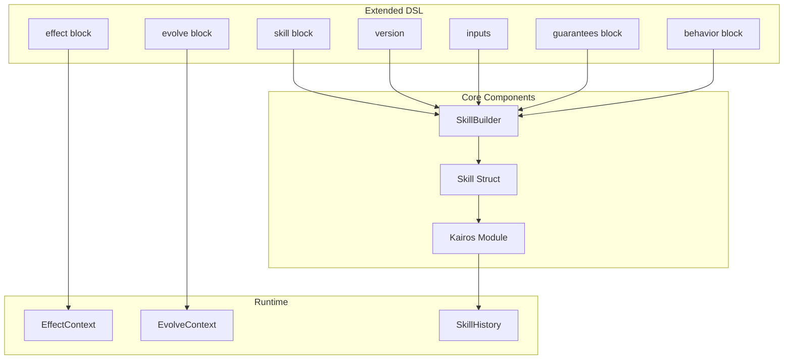

# Pure Skills DSL Extension 実装プラン

**Status**: Completed (2026-01-15)
**Original Plan**: pure_skills_dsl_extension_45d4c2d7.plan.md

## 概要

Pure Skill Design仕様に準拠するため、skills.rbのDSL構文を拡張し、version/inputs/effect/evolve DSLと自己参照機構（Kairosモジュール）を追加する。

## 実装タスク

| Phase | タスク | Status |
|-------|--------|--------|
| 1 | Skill Structに version, inputs, effects, evolution_rules, created_at を追加 | completed |
| 2 | SkillBuilderに version, inputs, guaranteesブロック, effect, evolve メソッドを追加 | completed |
| 3 | skill_contexts.rb（GuaranteesContext, EffectContext, EvolveContext）を作成 | completed |
| 4 | kairos.rb（自己参照モジュール）を作成 | completed |
| 5 | skills/sushi.rb を新DSL構文で更新 | completed |
| 6 | SafeEvolverをevolve DSLルールと統合 | completed |

## 目的

`log/kairos_pure_skill_design_self_referential_skills_idea_20260115.md` の設計仕様に準拠するため、以下の機能を追加：

1. **version** - スキルのバージョン管理
2. **inputs** - 明示的な入力宣言
3. **guarantees** - ブロック形式の不変条件
4. **effect** - 名前付き副作用コンテキスト
5. **evolve** - 自己進化ルール
6. **Kairos** - グローバル自己参照モジュール

## 拡張後のDSL構文

```ruby
skill :pipeline_generation do
  version "1.0"
  
  inputs :genomic_context, :parameters
  
  guarantees do
    reproducible
    explainable
  end
  
  behavior do |input|
    # Pure transformation (no side effects)
    Pipeline.plan(input)
  end
  
  effect :execution do
    requires :human_approval
    records :audit_trail
    
    run do |plan|
      Executor.run(plan)
    end
  end
  
  evolve do
    allow :parameter_defaults
    deny :guarantees
    
    when_condition :high_failure_rate do |current|
      propose change(:parameter_defaults) do |defaults|
        defaults.merge(timeout: 20)
      end
    end
  end
end

# Self-referential introspection
skill :self_inspection do
  behavior do
    Kairos.skills.map do |skill|
      {
        name: skill.id,
        version: skill.version,
        guarantees: skill.guarantees,
        history: skill.history
      }
    end
  end
end
```

## アーキテクチャ



## Phase 1: Skill Struct拡張

`lib/sushi_mcp/skills_dsl.rb` のSkill Structを拡張：

```ruby
Skill = Struct.new(
  :id,
  :version,           # NEW
  :title,
  :use_when,
  :inputs,            # NEW: Array of symbols
  :requires,
  :guarantees,        # CHANGED: Array of guarantees
  :depends_on,
  :content,
  :behavior,
  :effects,           # NEW: Hash of EffectContext
  :evolution_rules,   # NEW: EvolveContext
  :created_at,        # NEW
  keyword_init: true
)
```

## Phase 2: SkillBuilder拡張

```ruby
class SkillBuilder
  def version(value)
    @data[:version] = value
  end
  
  def inputs(*args)
    @data[:inputs] = args
  end
  
  def guarantees(&block)
    ctx = GuaranteesContext.new
    ctx.instance_eval(&block)
    @data[:guarantees] = ctx.guarantees
  end
  
  def effect(name, &block)
    @data[:effects] ||= {}
    ctx = EffectContext.new(name)
    ctx.instance_eval(&block)
    @data[:effects][name] = ctx
  end
  
  def evolve(&block)
    ctx = EvolveContext.new(@id)
    ctx.instance_eval(&block)
    @data[:evolution_rules] = ctx
  end
end
```

## Phase 3: Context Classes

**新規ファイル**: `lib/sushi_mcp/skill_contexts.rb`

```ruby
module SushiMcp
  # Guarantees block context
  class GuaranteesContext
    attr_reader :guarantees
    
    def initialize
      @guarantees = []
    end
    
    def method_missing(name, *args)
      @guarantees << name
    end
  end
  
  # Effect block context
  class EffectContext
    attr_reader :name, :requirements, :recordings, :runner
    
    def initialize(name)
      @name = name
      @requirements = []
      @recordings = []
    end
    
    def requires(condition)
      @requirements << condition
    end
    
    def records(what)
      @recordings << what
    end
    
    def run(&block)
      @runner = block
    end
  end
  
  # Evolve block context
  class EvolveContext
    attr_reader :skill_id, :allowed, :denied, :conditions
    
    def initialize(skill_id)
      @skill_id = skill_id
      @allowed = []
      @denied = []
      @conditions = {}
    end
    
    def allow(*fields)
      @allowed.concat(fields)
    end
    
    def deny(*fields)
      @denied.concat(fields)
    end
    
    def when_condition(name, &block)
      @conditions[name] = block
    end
  end
end
```

## Phase 4: Kairosモジュール（自己参照）

**新規ファイル**: `lib/sushi_mcp/kairos.rb`

```ruby
module SushiMcp
  module Kairos
    class << self
      def skills
        @provider ||= DslSkillsProvider.new
        @provider.skills
      end
      
      def skill(id)
        skills.find { |s| s.id == id.to_sym }
      end
      
      def reload!
        @provider = nil
      end
      
      def history(skill_id)
        SkillHistory.for(skill_id)
      end
    end
  end
  
  class SkillHistory
    def self.for(skill_id)
      versions = VersionManager.list_versions
      versions.select { |v| v[:filename].include?(skill_id.to_s) }
    end
  end
end
```

## Phase 5: skills/sushi.rb サンプル更新

```ruby
skill :arch_010 do
  version "1.0"
  
  inputs :sushi_context
  
  guarantees do
    architecture_comprehension
    component_relationships
  end
  
  behavior do |ctx|
    # Pure: returns documentation only
    { components: [...], relationships: [...] }
  end
end

skill :self_inspection do
  version "1.0"
  
  inputs :none
  
  guarantees do
    read_only
    no_side_effects
  end
  
  behavior do
    Kairos.skills.map do |skill|
      {
        id: skill.id,
        version: skill.version,
        guarantees: skill.guarantees
      }
    end
  end
end

skill :core_safety do
  version "1.0"
  
  guarantees do
    immutable
    always_enforced
  end
  
  evolve do
    deny :guarantees
    deny :behavior
  end
  
  content <<~MD
    Core safety rules that cannot be modified.
  MD
end
```

## Phase 6: SafeEvolver拡張

`evolve` DSLルールとの統合：

```ruby
def self.propose(skill_id:, field:, new_value:)
  skill = Kairos.skill(skill_id)
  return { success: false, error: "Skill not found" } unless skill
  
  rules = skill.evolution_rules
  return { success: false, error: "No evolution rules defined" } unless rules
  
  if rules.denied.include?(field.to_sym)
    return { success: false, error: "Field '#{field}' is denied for evolution" }
  end
  
  unless rules.allowed.include?(field.to_sym)
    return { success: false, error: "Field '#{field}' is not allowed for evolution" }
  end
  
  # Continue with existing validation...
end
```

## ファイル構成（完成時）

```
lib/sushi_mcp/
├── skills_dsl.rb          # 拡張: version, inputs, effect, evolve
├── skill_contexts.rb      # 新規: GuaranteesContext, EffectContext, EvolveContext
├── kairos.rb              # 新規: 自己参照モジュール
├── safe_evolver.rb        # 拡張: evolve DSLとの統合
└── ...

skills/
├── sushi.rb               # 更新: 新DSL構文使用
└── ...
```

## 後方互換性

- 既存の単純なDSL構文（`requires :symbol`, `guarantees :symbol`）は引き続き動作
- `version`, `inputs`, `effect`, `evolve` はすべてオプショナル
- 新機能を使わない既存スキルはそのまま動作

---

## 関連ドキュメント

- [設計思想](log/kairos_pure_skill_design_self_referential_skills_idea_20260115.md)
- [DSL/AST 設計提案](log/kairos_skills_dsl_ast_design_proposal_20260115.md)
- [Self-Evolution 実装プラン](log/kairos_self_evolution_implementation_plan_20260115.md)
