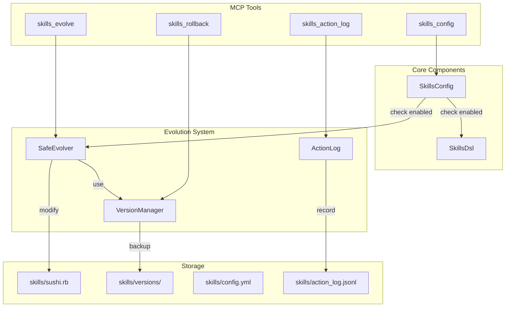
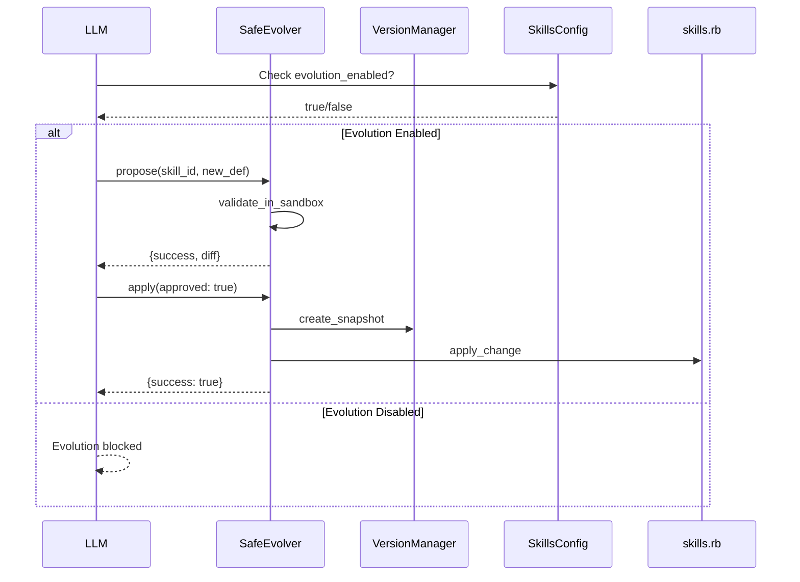

# Skills Self-Evolution System 実装プラン

**Status**: Completed (2026-01-15)

## 概要

skills.rbに自己言及（行動履歴）・自己改変・ON/OFF制御・ロールバック機能を追加し、安全に進化可能なMinimum-Nomicシステムを実装する。

## 実装タスク

| Phase | タスク | Status |
|-------|--------|--------|
| 1 | ActionLogクラスとskills_action_logツールの実装 | completed |
| 2 | SkillsConfigクラスとconfig.yml、skills_configツールの実装 | completed |
| 3 | VersionManagerクラスとskills_rollbackツールの実装 | completed |
| 4 | SafeEvolverクラスとskills_evolveツールの実装 | completed |
| 5 | tool_registry.rbへの統合と動作確認 | completed |

## 目的

skills.rbに以下の機能を追加：
1. **自己言及（ActionLog）**: LLMが何をしたかを記録・参照
2. **自己改変（SafeEvolver）**: skills.rbを安全に更新
3. **ON/OFF制御（SkillsConfig）**: 暴走時に機能停止
4. **ロールバック（VersionManager）**: 過去の状態に復元

## アーキテクチャ



## 新規ファイル構成

```
lib/sushi_mcp/
├── action_log.rb          # 行動履歴記録
├── safe_evolver.rb        # 安全な自己改変
├── skills_config.rb       # ON/OFF設定管理
├── version_manager.rb     # バージョン管理
└── tools/
    ├── skills_action_log.rb   # 履歴参照ツール
    ├── skills_evolve.rb       # 変更提案・適用ツール
    ├── skills_config.rb       # 設定変更ツール
    └── skills_rollback.rb     # ロールバックツール

skills/
├── sushi.rb               # 既存
├── config.yml             # 新規: 設定ファイル
├── action_log.jsonl       # 新規: 行動ログ
└── versions/              # 新規: バージョン履歴
    └── .gitkeep
```

## Phase 1: ActionLog（自己言及）

**ファイル**: [lib/sushi_mcp/action_log.rb](lib/sushi_mcp/action_log.rb)

```ruby
module SushiMcp
  class ActionLog
    LOG_PATH = File.expand_path('../../skills/action_log.jsonl', __dir__)
    
    def self.record(action:, skill_id: nil, details: nil)
      entry = {
        timestamp: Time.now.iso8601,
        action: action,
        skill_id: skill_id,
        details: details
      }
      File.open(LOG_PATH, 'a') { |f| f.puts(entry.to_json) }
    end
    
    def self.history(limit: 50)
      return [] unless File.exist?(LOG_PATH)
      File.readlines(LOG_PATH).last(limit).map { |l| JSON.parse(l) }
    end
    
    def self.clear!
      File.write(LOG_PATH, '')
    end
  end
end
```

**ツール**: `skills_action_log` - 行動履歴の参照・検索

## Phase 2: SkillsConfig（ON/OFF制御）

**ファイル**: [lib/sushi_mcp/skills_config.rb](lib/sushi_mcp/skills_config.rb)

```ruby
module SushiMcp
  class SkillsConfig
    CONFIG_PATH = File.expand_path('../../skills/config.yml', __dir__)
    
    DEFAULTS = {
      'enabled' => true,
      'evolution_enabled' => false,  # 自己改変はデフォルトOFF
      'max_evolutions_per_session' => 3,
      'require_human_approval' => true,
      'immutable_skills' => ['core_safety']
    }.freeze
    
    def self.load
      return DEFAULTS.dup unless File.exist?(CONFIG_PATH)
      YAML.safe_load(File.read(CONFIG_PATH)) || DEFAULTS.dup
    end
    
    def self.save(config)
      File.write(CONFIG_PATH, config.to_yaml)
    end
    
    def self.enabled?
      load['enabled']
    end
    
    def self.evolution_enabled?
      load['evolution_enabled'] && enabled?
    end
    
    def self.disable!
      config = load
      config['enabled'] = false
      save(config)
    end
  end
end
```

**設定ファイル**: [skills/config.yml](skills/config.yml)

```yaml
enabled: true
evolution_enabled: false
max_evolutions_per_session: 3
require_human_approval: true
immutable_skills:
  - core_safety
```

**ツール**: `skills_config` - 設定の参照・変更

## Phase 3: VersionManager（ロールバック）

**ファイル**: [lib/sushi_mcp/version_manager.rb](lib/sushi_mcp/version_manager.rb)

```ruby
module SushiMcp
  class VersionManager
    VERSIONS_DIR = File.expand_path('../../skills/versions', __dir__)
    DSL_PATH = File.expand_path('../../skills/sushi.rb', __dir__)
    
    def self.create_snapshot(reason: nil)
      FileUtils.mkdir_p(VERSIONS_DIR)
      timestamp = Time.now.strftime('%Y%m%d_%H%M%S')
      filename = "sushi_#{timestamp}.rb"
      FileUtils.cp(DSL_PATH, File.join(VERSIONS_DIR, filename))
      
      # メタデータも保存
      meta = { timestamp: timestamp, reason: reason, filename: filename }
      meta_path = File.join(VERSIONS_DIR, "#{filename}.meta.json")
      File.write(meta_path, meta.to_json)
      
      filename
    end
    
    def self.list_versions
      Dir[File.join(VERSIONS_DIR, '*.rb')].map do |f|
        { filename: File.basename(f), created: File.mtime(f) }
      end.sort_by { |v| v[:created] }.reverse
    end
    
    def self.rollback(version_filename)
      version_path = File.join(VERSIONS_DIR, version_filename)
      raise "Version not found: #{version_filename}" unless File.exist?(version_path)
      
      # 現在の状態をバックアップしてからロールバック
      create_snapshot(reason: "pre-rollback backup")
      FileUtils.cp(version_path, DSL_PATH)
    end
  end
end
```

**ツール**: `skills_rollback` - バージョン一覧・ロールバック実行

## Phase 4: SafeEvolver（自己改変）

**ファイル**: [lib/sushi_mcp/safe_evolver.rb](lib/sushi_mcp/safe_evolver.rb)

```ruby
module SushiMcp
  class SafeEvolver
    class EvolutionError < StandardError; end
    
    def self.propose(skill_id:, new_definition:)
      # 1. 設定チェック
      unless SkillsConfig.evolution_enabled?
        return { success: false, error: "Evolution is disabled" }
      end
      
      # 2. 不変スキルチェック
      immutable = SkillsConfig.load['immutable_skills'] || []
      if immutable.include?(skill_id.to_s)
        return { success: false, error: "Skill #{skill_id} is immutable" }
      end
      
      # 3. 構文検証（サンドボックス）
      validation = validate_in_sandbox(new_definition)
      return validation unless validation[:success]
      
      # 4. 差分生成
      { success: true, diff: generate_diff(skill_id, new_definition) }
    end
    
    def self.apply(skill_id:, new_definition:, approved: false)
      config = SkillsConfig.load
      
      if config['require_human_approval'] && !approved
        return { success: false, error: "Human approval required", pending: true }
      end
      
      # スナップショット作成
      VersionManager.create_snapshot(reason: "before evolving #{skill_id}")
      
      # 変更適用
      apply_change(skill_id, new_definition)
      
      # ログ記録
      ActionLog.record(
        action: 'skill_evolved',
        skill_id: skill_id,
        details: { new_definition: new_definition }
      )
      
      { success: true }
    end
    
    private
    
    def self.validate_in_sandbox(definition)
      # 別プロセスで構文チェック
      begin
        RubyVM::AbstractSyntaxTree.parse(definition)
        { success: true }
      rescue SyntaxError => e
        { success: false, error: "Syntax error: #{e.message}" }
      end
    end
  end
end
```

**ツール**: `skills_evolve` - 変更提案・検証・適用

## Phase 5: ツール統合

[lib/sushi_mcp/tool_registry.rb](lib/sushi_mcp/tool_registry.rb) に追加：

```ruby
register_if_defined('SushiMcp::Tools::SkillsActionLog')
register_if_defined('SushiMcp::Tools::SkillsEvolve')
register_if_defined('SushiMcp::Tools::SkillsConfigTool')
register_if_defined('SushiMcp::Tools::SkillsRollback')
```

## 安全機構

| 機構 | 説明 |
|------|------|
| **evolution_enabled: false** | デフォルトで自己改変OFF |
| **require_human_approval** | 変更前に人間の承認を要求 |
| **immutable_skills** | 変更不可能なスキルを指定 |
| **max_evolutions_per_session** | セッション当たりの変更回数制限 |
| **自動スナップショット** | 変更前に必ずバックアップ |
| **サンドボックス検証** | 適用前に構文チェック |

## 使用フロー


