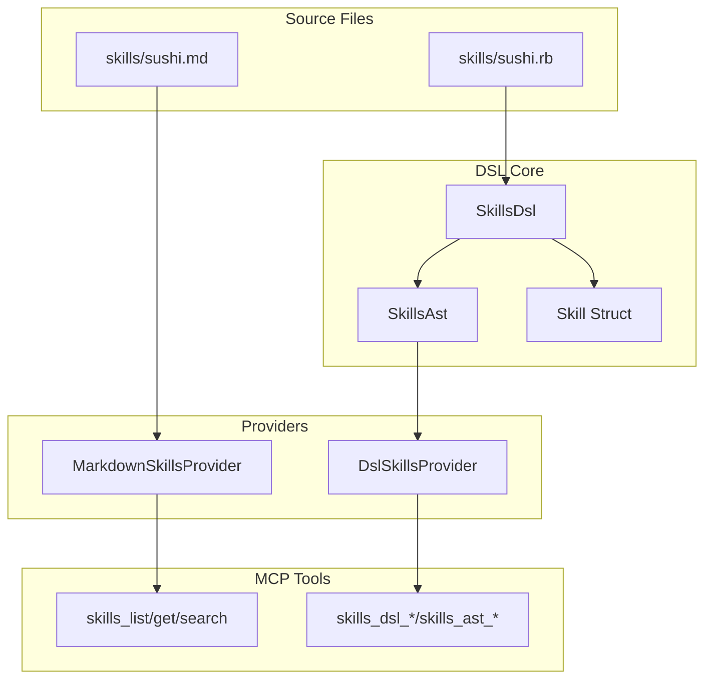

# Skills DSL/AST 実装プラン

**Status**: Completed (2026-01-15)

## 概要

skills.mdのMarkdownベース実装を残しつつ、skills.rbとしてRuby DSL/AST化した拡張機能を追加する。既存のMCPツールとの後方互換性を維持しながら、段階的に新機能を実装する。

## 実装タスク

| Phase | タスク | Status |
|-------|--------|--------|
| 1 | SkillsDslクラスとSkillBuilder（最小DSLコア）の実装 | completed |
| 1 | skills/sushi.rb サンプル作成（ARCH-010の移植） | completed |
| 2 | SkillsAstクラス（AST解析・検証・diff）の実装 | completed |
| 3 | DslSkillsProviderの実装 | completed |
| 4 | 新MCPツール（skills_dsl_list, skills_dsl_get, skills_dsl_validate）の実装 | completed |
| 4 | ASTツール（skills_ast_inspect, skills_ast_diff）の実装 | completed |
| 5 | tool_registry.rbに新ツールを登録 | completed |

## 目的

既存の `skills/sushi.md` (Markdown) ベースの実装を維持しつつ、`skills/sushi.rb` (Ruby DSL) を追加し、AST化による検証・自己言及・履歴管理を可能にする。

## アーキテクチャ



## 実装フェーズ

### Phase 1: 最小DSLコア実装

**新規ファイル**: [lib/sushi_mcp/skills_dsl.rb](lib/sushi_mcp/skills_dsl.rb)

```ruby
module SushiMcp
  class SkillsDsl
    Skill = Struct.new(
      :id, :title, :use_when, :requires, :guarantees, 
      :depends_on, :content, :behavior, keyword_init: true
    )
    
    def self.load(path)
      dsl = new
      dsl.instance_eval(File.read(path), path)
      dsl.skills
    end
    
    def initialize
      @skills = []
    end
    
    attr_reader :skills
    
    def skill(id, &block)
      builder = SkillBuilder.new(id)
      builder.instance_eval(&block)
      @skills << builder.build
    end
  end
  
  class SkillBuilder
    # DSL メソッド: title, use_when, requires, guarantees, depends_on, content, behavior
  end
end
```

**新規ファイル**: [skills/sushi.rb](skills/sushi.rb) (最小サンプル)

```ruby
skill :arch_010 do
  title "System Architecture"
  use_when "Understanding component relationships"
  requires :sushi_context
  guarantees :architecture_comprehension
  
  content <<~MD
    ### Core Components
    ...（既存のARCH-010セクションの内容を移植）
  MD
end
```

### Phase 2: AST保存・検査機構

**新規ファイル**: [lib/sushi_mcp/skills_ast.rb](lib/sushi_mcp/skills_ast.rb)

```ruby
module SushiMcp
  class SkillsAst
    def self.parse(path)
      RubyVM::AbstractSyntaxTree.parse(File.read(path))
    end
    
    def self.extract_skill_nodes(ast)
      # skill ブロックのASTノードを抽出
    end
    
    def self.validate(skill_nodes)
      # 必須フィールドの検証
      # 依存関係の循環チェック
      # 危険なコードの検出
    end
    
    def self.diff(old_ast, new_ast)
      # スキル定義の差分を意味論的に検出
    end
  end
end
```

### Phase 3: DslSkillsProvider実装

**新規ファイル**: [lib/sushi_mcp/dsl_skills_provider.rb](lib/sushi_mcp/dsl_skills_provider.rb)

```ruby
module SushiMcp
  class DslSkillsProvider
    DSL_PATH = File.expand_path('../../skills/sushi.rb', __dir__)
    
    def initialize(dsl_path = DSL_PATH)
      @dsl_path = dsl_path
      @skills = nil
    end
    
    def skills
      @skills ||= SkillsDsl.load(@dsl_path)
    end
    
    def list_skills
      skills.map { |s| { id: s.id, title: s.title, use_when: s.use_when } }
    end
    
    def get_skill(id)
      skills.find { |s| s.id == id.to_sym }
    end
    
    def search_skills(query, max_results = 3)
      # 正規表現マッチ
    end
    
    def ast
      @ast ||= SkillsAst.parse(@dsl_path)
    end
    
    def validate
      SkillsAst.validate(ast)
    end
  end
end
```

### Phase 4: 新MCPツール追加

以下の新ツールを追加（既存ツールには影響なし）:

| ツール名 | 機能 |
|---------|------|
| `skills_dsl_list` | DSL定義されたスキル一覧 |
| `skills_dsl_get` | DSLスキルの詳細取得 |
| `skills_dsl_validate` | スキル定義の検証 |
| `skills_ast_inspect` | AST構造の表示 |
| `skills_ast_diff` | スキル変更差分の表示 |

**新規ファイル例**: [lib/sushi_mcp/tools/skills_dsl_list.rb](lib/sushi_mcp/tools/skills_dsl_list.rb)

```ruby
module SushiMcp
  module Tools
    class SkillsDslList < BaseTool
      def name
        'skills_dsl_list'
      end
      
      def call(arguments)
        provider = DslSkillsProvider.new
        skills = provider.list_skills
        # フォーマット出力
      end
    end
  end
end
```

### Phase 5: ツール登録

[lib/sushi_mcp/tool_registry.rb](lib/sushi_mcp/tool_registry.rb) に新ツールを追加:

```ruby
register_if_defined('SushiMcp::Tools::SkillsDslList')
register_if_defined('SushiMcp::Tools::SkillsDslGet')
register_if_defined('SushiMcp::Tools::SkillsDslValidate')
register_if_defined('SushiMcp::Tools::SkillsAstInspect')
register_if_defined('SushiMcp::Tools::SkillsAstDiff')
```

## ファイル構成（完成時）

```
lib/sushi_mcp/
├── skills_parser.rb          # 既存（Markdown用）
├── skills_dsl.rb             # 新規: DSLコア
├── skills_ast.rb             # 新規: AST操作
├── dsl_skills_provider.rb    # 新規: DSLプロバイダ
└── tools/
    ├── skills_list.rb        # 既存
    ├── skills_get.rb         # 既存
    ├── skills_search.rb      # 既存
    ├── skills_dsl_list.rb    # 新規
    ├── skills_dsl_get.rb     # 新規
    ├── skills_dsl_validate.rb # 新規
    ├── skills_ast_inspect.rb # 新規
    └── skills_ast_diff.rb    # 新規

skills/
├── sushi.md                  # 既存（後方互換）
└── sushi.rb                  # 新規: DSL定義
```

## 後方互換性

- 既存の `skills_list`, `skills_get`, `skills_search` は変更なし
- `skills/sushi.md` はそのまま利用可能
- 新ツールは `skills_dsl_*`, `skills_ast_*` プレフィックスで区別
