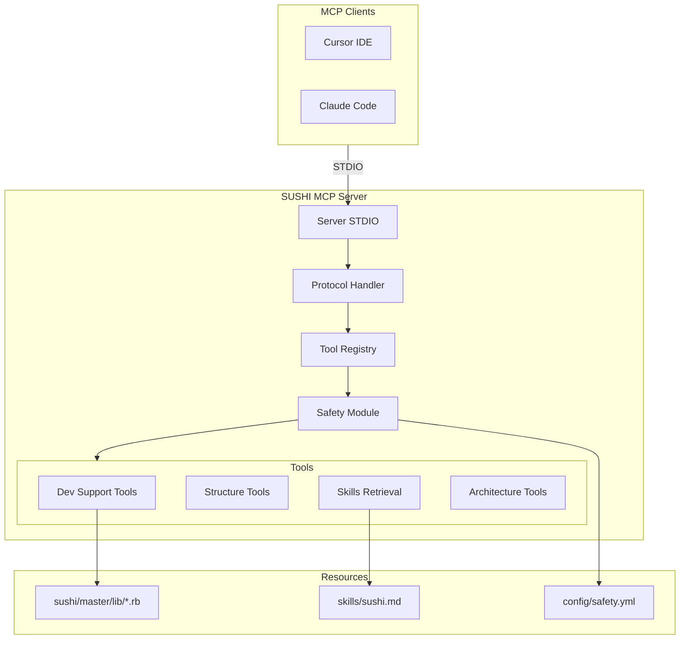

# SUSHI Self-Maintenance MCP Server 実装プラン

## 現状

Phase 0（Hello World MCP）は完了済み。以下の基盤が構築されている：

- STDIO接続の動作確認済み ([lib/sushi_mcp/server.rb](lib/sushi_mcp/server.rb))
- JSON-RPC プロトコル処理 ([lib/sushi_mcp/protocol.rb](lib/sushi_mcp/protocol.rb))
- ツール登録・ディスパッチ機構 ([lib/sushi_mcp/tool_registry.rb](lib/sushi_mcp/tool_registry.rb))
- ベースツールクラス ([lib/sushi_mcp/tools/base_tool.rb](lib/sushi_mcp/tools/base_tool.rb))

## 全体アーキテクチャ



---

## Phase 1: Dev Support MVP（read-only、最小で効く）

**目標**: SUSHI開発で「検索 → 読む」が成立し、日常で使える

### 1.1 安全設計モジュール

新規: [lib/sushi_mcp/safety.rb](lib/sushi_mcp/safety.rb)

```ruby
# SAFE_ROOT固定、blocklist、出力制限の実装
SAFE_ROOT = File.expand_path('../../..', __FILE__)
BLOCKLIST = %w[.env .env.* master.key *.yml.enc id_rsa *.pem *.key *.sqlite3]
MAX_READ_BYTES = 100_000
MAX_SEARCH_LINES = 500
```

### 1.2 Dev Support Tools

| Tool | 説明 | 入力 |
|------|------|------|
| `search_repo` | ripgrepでコード検索 | `query`, `path?`, `max_results?` |
| `read_file` | 安全なファイル読み取り | `path`, `max_bytes?` |

実装ファイル:

- [lib/sushi_mcp/tools/search_repo.rb](lib/sushi_mcp/tools/search_repo.rb)
- [lib/sushi_mcp/tools/read_file.rb](lib/sushi_mcp/tools/read_file.rb)

---

## Phase 2: Structure Support（構造理解を高速化）

**目標**: SUSHI/ezRunのアーキテクチャ理解の入口をAIが案内できる

### 2.1 Structure Tools

| Tool | 説明 | 入力 |
|------|------|------|
| `list_tree` | ディレクトリ構造の要約 | `path?`, `depth?` |
| `find_files` | glob検索でファイル探索 | `glob`, `path?` |
| `list_sushi_apps` | SUSHI App一覧（lib/*.rb） | なし |

実装ファイル:

- [lib/sushi_mcp/tools/list_tree.rb](lib/sushi_mcp/tools/list_tree.rb)
- [lib/sushi_mcp/tools/find_files.rb](lib/sushi_mcp/tools/find_files.rb)
- [lib/sushi_mcp/tools/list_sushi_apps.rb](lib/sushi_mcp/tools/list_sushi_apps.rb)

---

## Phase 3: Skills Retrieval（トークン節約の本丸）

**目標**: [skills/sushi.md](skills/sushi.md) を全文貼りせず、必要箇所だけ取り出して使える

### 3.1 Skills Retrieval Tools

| Tool | 説明 | 入力 |
|------|------|------|
| `skills_list` | 利用可能なセクション一覧 | なし |
| `skills_get` | セクションID指定で取得 | `section_id` (e.g., "ARCH-010") |
| `skills_search` | キーワード検索で該当セクション抽出 | `query`, `max_sections?` |

Skills文書は既に階層化されており、セクションID（`ARCH-010`, `DEV-020`等）で効率的に参照可能。

実装ファイル:

- [lib/sushi_mcp/tools/skills_list.rb](lib/sushi_mcp/tools/skills_list.rb)
- [lib/sushi_mcp/tools/skills_get.rb](lib/sushi_mcp/tools/skills_get.rb)
- [lib/sushi_mcp/tools/skills_search.rb](lib/sushi_mcp/tools/skills_search.rb)
- [lib/sushi_mcp/skills_parser.rb](lib/sushi_mcp/skills_parser.rb) - Markdown解析

---

## Phase 4: SUSHI App Development Support（開発支援特化）

**目標**: 新規SUSHI App作成、既存App理解をAIがガイドできる

### 4.1 App Analysis Tools

| Tool | 説明 | 入力 |
|------|------|------|
| `get_app_structure` | Appの構造解析（params, required_columns等） | `app_name` |
| `get_app_template` | 新規App作成用テンプレート生成 | `base_app?` |
| `compare_apps` | 2つのAppの差分比較 | `app1`, `app2` |

実装ファイル:

- [lib/sushi_mcp/tools/get_app_structure.rb](lib/sushi_mcp/tools/get_app_structure.rb)
- [lib/sushi_mcp/tools/get_app_template.rb](lib/sushi_mcp/tools/get_app_template.rb)
- [lib/sushi_mcp/tools/compare_apps.rb](lib/sushi_mcp/tools/compare_apps.rb)
- [lib/sushi_mcp/app_parser.rb](lib/sushi_mcp/app_parser.rb) - Ruby App解析

---

## Phase 5: 提案型メンテ（書き込みはしない / 人間が適用）

**目標**: AIがパッチを提案し、人間がapplyする運用で安全に加速

| Tool | 説明 | 入力 |
|------|------|------|
| `propose_patch` | diff形式でパッチ提案（適用はしない） | `file`, `changes` |
| `generate_commit_message` | 変更内容からコミットメッセージ生成 | `changes_summary` |

---

## Phase 6: 限定実行（将来、必要になったら）

allowlist固定コマンドのみ実行可能：

| Tool | 説明 | 許可コマンド |
|------|------|-------------|
| `run_tests` | テスト実行 | `bundle exec rspec` |
| `lint_check` | Lint実行 | `bundle exec rubocop` |

---

## 実装優先度

**Phase 1 (MVP)** を最優先で実装し、実際のSUSHI開発で運用テストを行う。

```
Phase 1 (1-2週間)
├── safety.rb
├── search_repo.rb
└── read_file.rb

Phase 2 (1週間)
├── list_tree.rb
├── find_files.rb
└── list_sushi_apps.rb

Phase 3 (1週間)
├── skills_parser.rb
├── skills_list.rb
├── skills_get.rb
└── skills_search.rb

Phase 4 (1-2週間)
├── app_parser.rb
├── get_app_structure.rb
├── get_app_template.rb
└── compare_apps.rb
```

---

## 設定ファイル

新規: [config/safety.yml](config/safety.yml)

```yaml
safe_root: "/srv/sushi/SUSHI_self_maintenance_mcp_server"
allowed_paths:
  - "sushi/master/lib"
  - "sushi/master/app"
  - "skills"
blocklist:
  - ".env*"
  - "*.key"
  - "*.pem"
  - "credentials*.yml.enc"
limits:
  max_read_bytes: 100000
  max_search_lines: 500
  max_tree_depth: 5
```

---

## 運用テスト項目（Phase 1完了時）

- [x] `search_repo`で「SushiFabric::SushiApp」を検索できる
- [x] `read_file`でApp定義ファイルを読み取れる
- [x] blocklist外のファイルは拒否される
- [x] 出力制限が適切に機能する
- [x] CursorからMCPサーバーに接続して操作できる

---

## 実装完了日

2026-01-15
