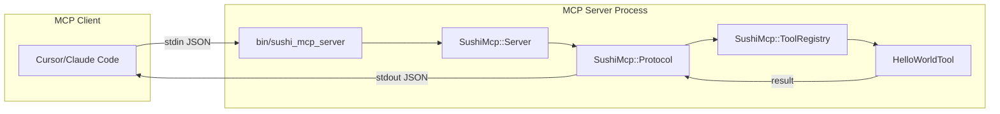

# SUSHI Self-Maintenance MCP Server - Phase 0 Implementation Plan

## Goal

Cursor / Claude Code から MCP server に **STDIO 接続**できることを確認する最小実装。

## Architecture Overview




## MCP Protocol (JSON-RPC 2.0 based)

Phase 0 で実装する必須メソッド:| Method | Direction | Purpose |

|--------|-----------|---------|

| `initialize` | client→server | 初期化要求、capabilities交換 |

| `initialized` | client→server | 初期化完了通知 |

| `tools/list` | client→server | 利用可能ツール一覧 |

| `tools/call` | client→server | ツール実行 |

## Directory Structure

```javascript
SUSHI_self_maintenance_mcp_server/
├── bin/
│   └── sushi_mcp_server           # Entry point (executable)
├── lib/
│   └── sushi_mcp/
│       ├── version.rb             # Version constant
│       ├── server.rb              # Main STDIO loop
│       ├── protocol.rb            # JSON-RPC message handling
│       ├── tool_registry.rb       # Tool registration/dispatch
│       └── tools/
│           ├── base_tool.rb       # Tool base class
│           └── hello_world.rb     # Phase 0 test tool
├── config/
│   └── mcp_config.yml             # Configuration (SAFE_ROOT, limits)
├── log/
│   ├── mcp_server.log             # Runtime log
│   └── sushi_self_maintenance_plan_20260106.md
├── skills/
│   └── sushi.md
├── Gemfile
├── Gemfile.lock
├── LICENSE
└── README.md
```


## Implementation Details

### 1. Gemfile

```ruby
source 'https://rubygems.org'

ruby '3.3.7'

# Rails environment (for future compatibility)
gem 'activesupport', '~> 7.0.8'

# JSON handling
gem 'json', '~> 2.7'

# Development
group :development do
  gem 'rubocop', require: false
end
```

**Note**: ActiveRecordやActionPackは不要。ActiveSupportのみ使用。

### 2. bin/sushi_mcp_server

```ruby
#!/usr/bin/env ruby
require_relative '../lib/sushi_mcp/server'
SushiMcp::Server.run
```


### 3. Core Classes

#### [lib/sushi_mcp/server.rb](SUSHI_self_maintenance_mcp_server/lib/sushi_mcp/server.rb)

- STDIO loop (`$stdin.gets` / `$stdout.puts`)
- Logging to stderr (MCP spec: stdout is for protocol only)
- Graceful shutdown on EOF

#### [lib/sushi_mcp/protocol.rb](SUSHI_self_maintenance_mcp_server/lib/sushi_mcp/protocol.rb)

- JSON-RPC 2.0 request/response parsing
- Method routing (`initialize`, `tools/list`, `tools/call`)
- Error response formatting

#### [lib/sushi_mcp/tool_registry.rb](SUSHI_self_maintenance_mcp_server/lib/sushi_mcp/tool_registry.rb)

- Auto-load tools from `lib/sushi_mcp/tools/`
- Tool schema generation for `tools/list`
- Tool dispatch for `tools/call`

#### [lib/sushi_mcp/tools/hello_world.rb](SUSHI_self_maintenance_mcp_server/lib/sushi_mcp/tools/hello_world.rb)

- Phase 0 test tool
- Returns fixed message: `"Hello from SUSHI MCP Server!"`

### 4. MCP Message Examples

**Client → Server: initialize**

```json
{"jsonrpc":"2.0","id":1,"method":"initialize","params":{"protocolVersion":"2024-11-05","capabilities":{},"clientInfo":{"name":"cursor","version":"1.0"}}}
```

**Server → Client: initialize response**

```json
{"jsonrpc":"2.0","id":1,"result":{"protocolVersion":"2024-11-05","capabilities":{"tools":{}},"serverInfo":{"name":"sushi-mcp-server","version":"0.1.0"}}}
```

**Client → Server: tools/list**

```json
{"jsonrpc":"2.0","id":2,"method":"tools/list","params":{}}
```

**Server → Client: tools/list response**

```json
{"jsonrpc":"2.0","id":2,"result":{"tools":[{"name":"hello_world","description":"Returns a hello message","inputSchema":{"type":"object","properties":{}}}]}}
```

**Client → Server: tools/call**

```json
{"jsonrpc":"2.0","id":3,"method":"tools/call","params":{"name":"hello_world","arguments":{}}}
```

**Server → Client: tools/call response**

```json
{"jsonrpc":"2.0","id":3,"result":{"content":[{"type":"text","text":"Hello from SUSHI MCP Server!"}]}}
```


## Cursor MCP Client Configuration

`~/.cursor/mcp.json` に追加:

```json
{
  "mcpServers": {
    "sushi-mcp-server": {
      "command": "ruby",
      "args": ["/srv/sushi/masa_test_sushi_20260106/SUSHI_self_maintenance_mcp_server/bin/sushi_mcp_server"],
      "env": {}
    }
  }
}
```


## Phase 0 Verification Checklist

- [x] `bin/sushi_mcp_server` が実行可能
- [ ] Cursor MCP設定後、サーバーリストに表示される
- [x] `hello_world` ツールが呼び出し可能
- [x] stderr にログが出力される（stdout はプロトコル専用）
- [x] EOF で graceful shutdown

## Files to Create

| File | Purpose |

|------|---------|

| `Gemfile` | Dependencies (activesupport, json) |

| `bin/sushi_mcp_server` | Executable entry point |

| `lib/sushi_mcp/version.rb` | Version constant |

| `lib/sushi_mcp/server.rb` | Main STDIO loop |

| `lib/sushi_mcp/protocol.rb` | JSON-RPC handling |

| `lib/sushi_mcp/tool_registry.rb` | Tool management |

| `lib/sushi_mcp/tools/base_tool.rb` | Tool base class |

| `lib/sushi_mcp/tools/hello_world.rb` | Test tool |

| `README.md` | Setup and usage guide |

## Excluded from Phase 0

- Safety module (SAFE_ROOT, blocklist) → Phase 1
- Real tools (search_repo, read_file) → Phase 1
- Skills retrieval → Phase 3

